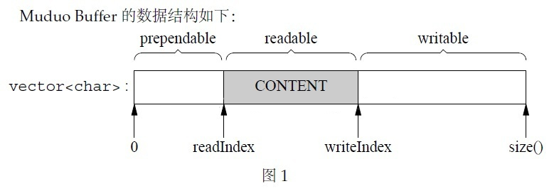

# 缓冲区

## `Buffer` 设计

- 对外表现为一块连续的内存
- 长度可自行增长，以适应不同大小的消息
- 内部以标准库容器封装 `char` 保存数据

## `Buffer` 类

```cpp
class Buffer {
public:
    Buffer(int buf_size = 1024); // 开始时，读写指针都指向内存开始的地方
    ~Buffer() = default;

    std::size_t readable_bytes() const; // 获取可读空间大小
    std::size_t writable_bytes() const ; // 获取可写空间大小
    std::size_t prependable_bytes() const; // 获取闲置空间大小
    
    const char* peek() const; // 获取读指针的地址，读操作不需要改变指针所指向的内容，所以声明为 const
    void retrieve(std::size_t len); // 读操作之后的复位操作，读指针向后移动 len
    void retrieve_until(const char* end); // 读指针移动至 end 的地址
    void retrieve_all(); // 清空 buf 数组，读写指针移归零
    std::string retrieve_all_to_str(); // retrieve_all 并且返回可读内容里的 char

    const char* begin_write() const; // 获取写指针的地址
    char* begin_write(); // 写操作需要改变指针所指向的内容

    void ensure_writeable(std::size_t len); // 确保可以写入，无法写入则调用 make_space 进行扩容
    void has_written(size_t len); // 写操作之后的复位操作，写指针向后移动 len

    void append(const char* str, std::size_t len); // 写入 str
    void append(const std::string& str);
    void append(const void* data, std::size_t len);
    void append(const Buffer& buff); // 将另一块 buffer 的读缓冲写入本 buffer

    ssize_t read_fd(int fd, int* save_errno); // fd 分散读到写缓冲
    ssize_t write_fd(int fd, int* save_errno); // 读缓冲的数据写入到 fd

private:
    char* begin_ptr(); // buffer_ 数组开始的地址
    const char* begin_ptr() const;
    void make_space(std::size_t len); // 扩容

    std::vector<char> buffer_;
    std::atomic<std::size_t> read_pos_; // 读指针，表示可以读取的数据的开始位置
    std::atomic<std::size_t> write_pos_; // 写指针，表示可以写入数据的起始位置
};
```



## 线程安全

- 微观来看，`Buffer` 不是线程安全的，因为 `vector` 不是线程安全的
- 宏观来看，`Buffer` 是线程安全的，因为一个 `Buffer` 只会在一条线程中被使用

## 自动扩容

如果读取到的数据写入缓冲时长度不够用时，先写到栈空间，然后刷写回来。

在刷写回来之前，把缓冲区扩容。扩容分两种:
- 闲置缓冲区与可写缓冲区的大小足够，把可读内容往前挪
- 闲置缓冲区与可写缓冲区的大小不足够，数组 `resize` 扩容